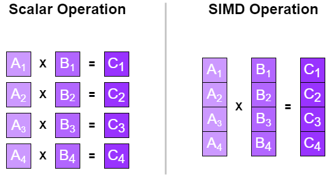
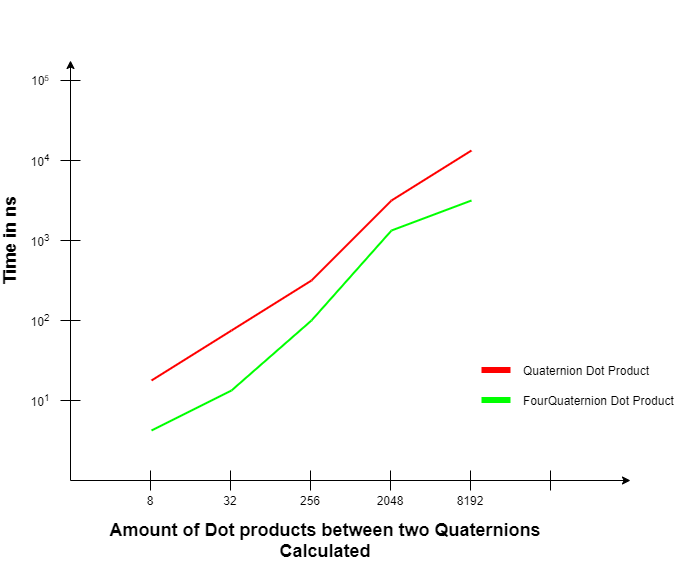

# Quaternions Intrinsics Optimisation
I'm currently a student at the SAE Institute of Geneva school in the Games Programming section. We're currently working on a Game Engine and we had to work by a team of two people on the implementation of basic things for the Game Engine.

Here, I am going to present to you an optimization I implemented by myself on the current Engine.

Quaternions are used to represent rotations. They’re based on complex numbers and aren’t easy to understand intuitively. You rarely access or modify individual Quaternion components. You’d just take existing rotation like the one in the transform and use them to construct new rotations. One of the main reasons we’re using Quaternions is to avoid gimbal lock which is the loss of one degree of freedom in a rotation.

**3 Axes Gimbal Rotation**


**Gimbal Lock**


<!--- Show a picture illustrating quaternions and rotations --->

My task was to optimize their use as much as I could so I decided to optimize them by working with the Intel Intrinsics functions.

Let’s have a look

## Quaternion
The basic implementation of the Quaternions looks like this:

```cpp
struct Quaternion
{
  float x;        //4 bytes
  float y;        //4 bytes
  float z;        //4 bytes
  float w;        //4 bytes
};
```

<!--- Show in code the implementation --->

The *Quaternion* contains 4 *floats* representing every values.

For the optimization I implemented, I decided to take the **Dot** function that calculates the Dot Product of 2 *Quaternions*, as a reference to test if it was working or not.

So here’s how the **Dot** function of my *Quaternion* struct looks like:
```cpp
static float Dot(Quaternion a, Quaternion b)
{
  return  a.x * b.x +
          a.y * b.y +
          a.z * b.z +
          a.w * b.w;
}
```

The **Dot** function takes each value of the *Quaternion a* and the *Quaternion b* to calculate the Dot product and it returns a *float*.

These are the most logical way someone would implement a Quaternion and a Dot Product. Now, let’s look at how I decided to optimize this calculus.

## FourQuaternion
To optimize my code, I decided to create a new Struct called *FourQuaternion*. The idea here is that this structure will contain 4 *Quaternions* instead of one.

Why am I doing that? Because instead of doing the calculus 4 times with a different *Quaternion*, I’ll be doing it only once by aligning each values of the Quaternions.

Why 4 floats then? Because 4 floats use 4 bytes each and an xmm register can contain 16 bytes.

The *FourQuaternion* structure looks like this:

```cpp
struct FourQuaternion
{
  std::array<float, 4> x;       //16 bytes
  std::array<float, 4> y;       //16 bytes
  std::array<float, 4> z;       //16 bytes
  std::array<float, 4> w;       //16 bytes
};
```
<!--- Show in code the implementation --->

It contains an array of 4 *floats* for each values in the *FourQuaternion*.

## Array of Structures of Arrays
I've decided to approach the problem by creating an AoSoA system.

To stock the values of my *FourQuaternions*, I decided to use an "Array of Structures of Arrays".
<!--- explain more about AoS SoA and AoSoA --->
"Structure of Arrays" is a layout separating elements of a structure into one parallel array per field. It makes it easier to use them by packing them into SIMD instructions. So I must create those first.



The reason why structures of arrays are better here is because the values will be aligned in code so it's much faster to load all values from memory in one block instead of going for each value and then aligning them.

- **Aos Alignment:** xyzwxyzwxyzwxyzw
- **SoA Alignment:** xxxxyyyyzzzzwwww

Every FourQuaternions will be stocked in an Array in the code, this is then an Array of Structures.

So combining these two values, it creates an Array of Structures of Array.

This is how I decided to implement my AoSoA:


## Intel Intrinsics
To do the functions with these arrays, I’ll have to use the Intel intrinsic instructions, which are C style functions that provide access to many Intel instructions without the need to write assembly code. 

Since I decided to use the **Dot** function as a test, let’s look at how it looks like in the *FourQuaternion*:
```cpp
static inline std::array<float, 4> Dot(FourQuaternion q1, FourQuaternion q2)
	{
		alignas(4 * sizeof(float)) std::array<float, 4> result;
		auto x1 = _mm_load_ps(q1.x.data());
		auto y1 = _mm_load_ps(q1.y.data());
		auto z1 = _mm_load_ps(q1.z.data());
		auto w1 = _mm_load_ps(q1.w.data());

		auto x2 = _mm_load_ps(q2.x.data());
		auto y2 = _mm_load_ps(q2.y.data());
		auto z2 = _mm_load_ps(q2.z.data());
		auto w2 = _mm_load_ps(q2.w.data());

		x1 = _mm_mul_ps(x1, x2);
		y1 = _mm_mul_ps(y1, y2);
		z1 = _mm_mul_ps(z1, z2);
		w1 = _mm_mul_ps(w1, w2);

		x1 = _mm_add_ps(x1, y1);
		z1 = _mm_add_ps(z1, w1);
		x1 = _mm_add_ps(x1, z1);
		_mm_store_ps(result.data(), x1);
		return result;
	}
```
<!--- Show in code the implementation --->

Let me explain what the Intel Intrinsics function do:
### ps
ps means packed single_precision floating-points. It basically means 4 * 32 bit floating point numbers stored as a 128-bit value.

### _mm_load_ps()
The **_mm_load_ps** function is loading from memory the values contained in the array. The values must be 16 bytes which correspond to an *array* of 4 *float* numbers, and they must be aligned in memory, that’s why we’re using arrays that align the *floats* in memory.

### _mm_mul_ps()
The  **_mm_mul_ps** function is multiplying 4 *floats* with 4 other *floats*.

### _mm_add_ps()
The **_mm_add_ps** function is adding two values together.

### _mm_store_ps()
The **_mm_store_ps** function is storing from the value *x1* to the memory.

Here, instead of calculating the functions 4 times with 4 different Quaternions, I’ll be calculating them only once. This will allow to spare a lot of performance as I will show you.

## Results
I created a test that calculated the **Dot product** of *n* quaternions using the MSVC compiler with an intel core i7 CPU on a Windows 10 PC. Here’s the result:

<!--- Show a graphic of the code --->


As you can see, the **BM_Dot_Intrinsics** is between 3 and 4 times faster than the **BM_Dot** which is a huge performance optimization.

I've looked on godbolt what was the main difference between the two functions in assembly code.

The Quaternion **Dot** function had to use a **jmp** to test the Dot product of 4 Quaternions. It calculated for each value the Dot product.

The FourQuaternion **Dot** function had no jump. Where the Quaternion **Dot** had to use **movss** (32-bit memory location) and **movsxd** functions, the FourQuaternion **Dot** is using **movaps** (128-bit memory location) and **movups** functions. This shows us that we achieved to use the Intel Intrinsics functions correctly.

## Lessons Learned
It was the first time for me to do that kind of exercise to optimize the most I could the code I implemented.

It was the first time I worked with AoSoAs and with the Intel Intrinsics functions. It was really interesting to know what was going with the compiler and what it was doing to try to optimize the code I was writing, and knowing that he couldn't guess everything.

I hope you had fun reading my Blogpost and that you learned something out of it :)

## Useful links
**Visualizing quaternions:** https://eater.net/quaternions

**Quaternion and FourQuaternion on Godbolt:** https://godbolt.org/z/SHBEmn 


<!--- Conclusion --->
